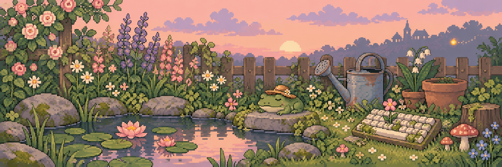

# hello, i'm blomma 🌱

Welcome to my little patch of the internet.

I'm Mikael: coder, baker, climber. I make small apps and useful tools, and have a soft spot for pixel art.

## 🌿 things i'm growing

- 🧶 **[Stitches](https://stitches.artsoftheinsane.com/)** — A knitting calculator that works out where your increases and decreases go.
- 📖 **[Timely Quote](https://timelyquotes.artsoftheinsane.com/)** — A clock that tells the time through passages from books.
- 🪴 **[dotfiles](https://github.com/blomma/dotfiles)** — The pots, soil, and slightly particular configuration that keep my workspace growing.

## 🌼 beyond the fence

[My little corner of the web](https://artsoftheinsane.com/) · [Wander through the repositories](https://github.com/blomma?tab=repositories)
